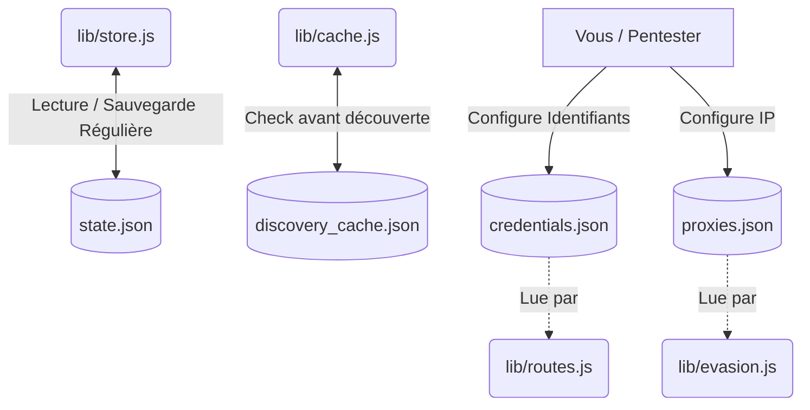

# BOLA-Shield : Persistance des Données (`/data`)

Ce dossier est le **Cerveau de Sauvegarde** du système BOLA-Shield. C'est ici que toutes les configurations manuelles et les états automatiques de l'audit sont stockés.

> [!CAUTION]
> Ce dossier peut contenir des mots de passe en clair (identifiants de test). Veillez à configurer correctement votre fichier `.gitignore` si vous poussez sur GitHub pour ne pas exposer le dossier `/data`.

## 🗂️ Cartographie des Fichiers

| Fichier | Rôle Principal | Risque si suppression |
| :--- | :--- | :--- |
| `state.json` | Fichier d'état généré automatiquement par `lib/store.js`. Contient l'état du scan actuel, les statistiques d'exposition, l'état du pare-feu et les cartes BOLA générées. | Le bot oubliera tout ce qu'il a fait (graphiques, configurations). Il devra recommencer l'audit depuis zéro. |
| `discovery_cache.json` | Cache de découverte généré par le Spider DAST. Garde en mémoire les routes d'API des domaines déjà explorés pour éviter de lancer Puppeteer systématiquement. | Le bot sera obligé de relancer Puppeteer et de re-crawler les cibles à chaque fois (très lent). |
| `credentials.json` | (Optionnel). Fichier manuel dans lequel vous pouvez configurer des identifiants valides (email/mot de passe) pour forcer le bot à attaquer une cible précise. **Ce fichier est lu dynamiquement par le navigateur fantôme (Spider) lors de l'exploration pour s'authentifier de manière humaine.** | Le bot utilisera des identifiants par défaut (`spider@audit.local`) qui échoueront souvent sur des plateformes de production. |
| `proxies.json` | (Optionnel). Fichier de configuration contenant des adresses IP de Proxys SOCKS5/HTTP réels pour effectuer de véritables attaques masquées. | Le bot continuera d'utiliser le "Spoofing" X-Forwarded-For (qui ne fonctionne que sur certaines cibles peu sécurisées). |

## 🏗️ Architecture des Données (Mermaid)

## 🛠️ Comment bien l'utiliser

1. **Effacement :** Vous pouvez supprimer `state.json` en toute sécurité si l'application BOLA-Shield est arrêtée. Cela permet de "Reset" (réinitialiser) complètement l'interface graphique et les statistiques.
2. **Édition :** Évitez de modifier `state.json` ou `discovery_cache.json` à la main pendant que BOLA-Shield fonctionne, au risque de corrompre les données JSON.
3. **Configurations avancées :** Pour auditer des systèmes d'entreprise très fermés, créez `credentials.json` avec la syntaxe requise par BOLA-Shield.
