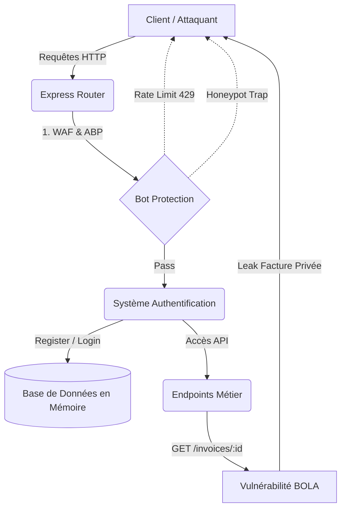

# Serveur Cible (Honeypot / Demo Target) : `/target-api`

Ce dossier contient un **serveur vulnérable complet** (une API NodeJS/Express). Il simule l'infrastructure métier d'une véritable entreprise (utilisateurs, factures, système de paiement).
Il a été conçu spécifiquement pour servir de **champ de tir** à BOLA-Shield afin de tester ses capacités offensives et défensives.

> [!TIP]
> **Ce dossier est totalement indépendant du reste du projet.** Il possède son propre `package.json` et doit être exécuté dans un processus séparé (`node target-api/server.js`).

## 🗂️ Cartographie des Fichiers

| Fichier | Rôle Principal | Risque si suppression |
| :--- | :--- | :--- |
| `server.js` | Le serveur principal. Contient toutes les routes API vulnérables aux failles BOLA (Insecure Direct Object References), ainsi que les protections Anti-Bot simulées (Rate Limiting, Proof-of-Time, Captchas). | Impossible de tester BOLA-Shield en local (Localhost). |
| `package.json` | Définit les dépendances de l'API Cible (Express, Cors, Express-Rate-Limit, etc.). | Impossible d'installer le serveur cible (`npm install` échouera). |

## 🏗️ Architecture du Serveur Cible (Mermaid)

## 🛠️ Comment bien l'utiliser

1. **Test des Protections :** Modifiez les constantes dans `server.js` (ex: limiter le nombre de requêtes ou réduire le temps du Proof-of-Time) pour tester si les modules d'évasion de BOLA-Shield (`lib/evasion.js`) sont assez robustes pour passer au travers.
2. **Ajout de Failles :** Vous pouvez ajouter de nouvelles routes métier (ex: `/api/v1/medical_records/:id`) pour complexifier l'audit BOLA.
3. **À Éviter :** Ne connectez jamais cette API à une vraie base de données de production (PostgreSQL/MySQL), car elle a été volontairement codée avec des failles de sécurité critiques !
